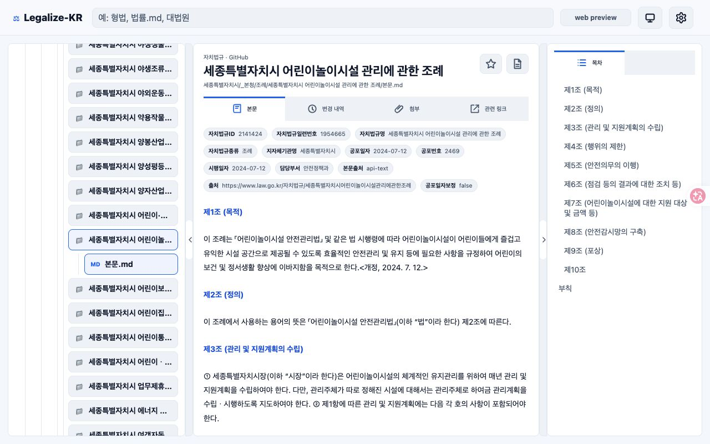
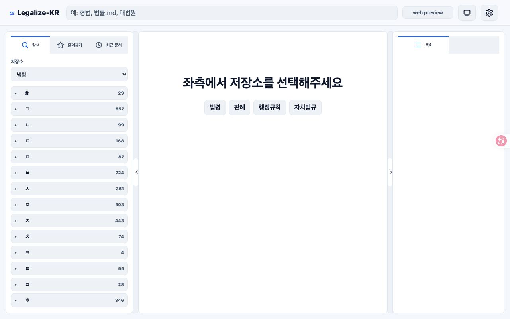
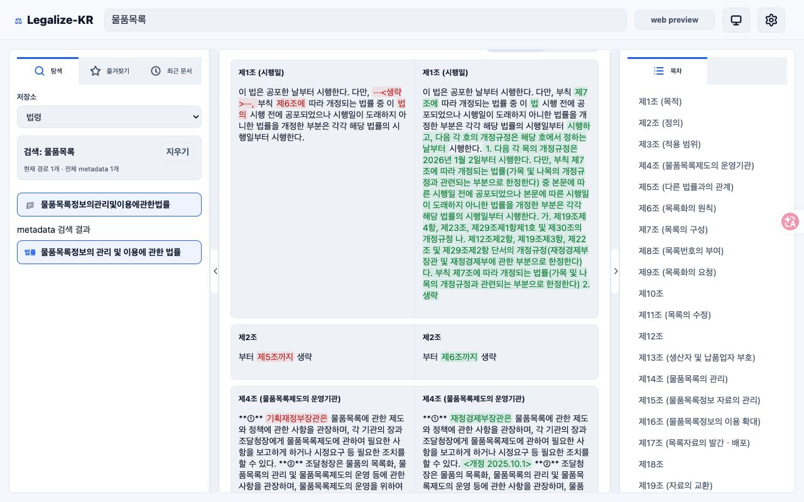
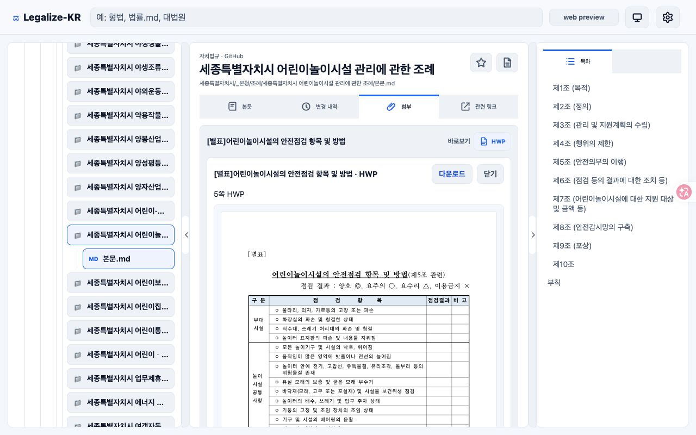
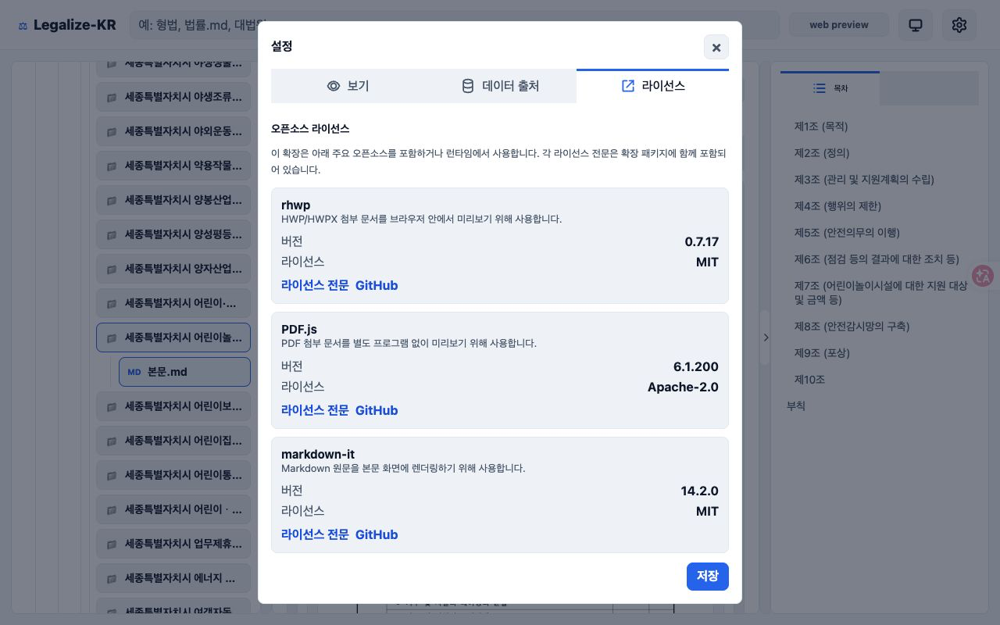

# Legalize-KR Viewer

Legalize-KR Viewer는 법령, 판례, 행정규칙, 자치법규 Markdown 저장소를 Chrome에서 읽기 전용으로 탐색하는 뷰어입니다. GitHub 원문과 로컬 원문 소스를 같은 화면에서 열람하고, 조문 목차, 첨부 미리보기, 개정 이력 비교를 제공합니다.



## 주요 기능

- 법령, 판례, 행정규칙, 자치법규 저장소 탐색
- Markdown 본문 렌더링과 조문/heading 기반 목차
- 문서 제목, frontmatter, 첨부, 관련 링크 분리 표시
- 개정 이력 2개 선택 후 나란히 보기 또는 한눈에 보기 비교
- 한눈에 보기에서 삭제된 내용은 빨간색과 삭제선으로 표시
- HWP/HWPX/PDF/image 첨부 원문 열기와 다운로드 fallback
- 즐겨찾기와 최근 문서
- 시스템, 밝게 보기, 어둡게 보기 테마
- GitHub 접근 토큰, Local Git Bridge, Local Folder 기반 원문 소스 설정

## 화면

### 저장소 선택



### 개정 이력 비교



### HWP 첨부 미리보기



### 설정과 오픈소스 라이선스



## 설치해서 확인하기

먼저 확장 산출물을 생성합니다.

```bash
npm run verify
```

Chrome에서 `chrome://extensions`를 열고 개발자 모드를 켠 뒤, `Load unpacked`에서 다음 디렉터리를 선택합니다.

```text
dist-extension
```

개발 중 빠르게 확인할 때는 `extension/`을 직접 선택할 수 있습니다. 배포 전 수동 확인은 항상 `dist-extension/` 기준으로 진행합니다.

## 사용 흐름

1. 확장 아이콘을 눌러 Legalize-KR Viewer를 새 탭으로 엽니다.
2. 좌측 탐색 패널에서 법령, 판례, 행정규칙, 자치법규 중 하나를 선택합니다.
3. 탐색 목록이나 검색으로 문서를 엽니다.
4. 중앙 본문에서 내용을 읽고, 우측 목차로 조문 위치를 이동합니다.
5. `변경 내역` 탭에서 비교할 개정 이력 2개를 선택합니다.
6. `나란히 보기` 또는 `한눈에 보기`로 변경된 조문을 확인합니다.
7. 필요한 경우 설정에서 테마, GitHub 접근 토큰, 원문 소스를 조정합니다.

## 원문 소스

- `GitHub`: 기본 모드입니다. 공개 GitHub 저장소의 목록, 원문, 개정 이력을 읽습니다.
- `Local Git Bridge`: `http://127.0.0.1:8765` 기본 URL의 로컬 브리지를 통해 로컬 Git 원문과 이력을 읽습니다.
- `Local Folder`: File System Access API로 사용자가 선택한 로컬 폴더의 Markdown 파일을 읽습니다.

뷰어는 원천 저장소를 수정하지 않습니다.

## 프로젝트 구조

- `extension/`: Chrome MV3 unpacked extension 원본
- `extension/icons/`: extension icon 원본 SVG와 크기별 PNG
- `extension/metadata/`: 검색 보조용 metadata index와 repo별 lazy shard
- `dist-extension/`: `npm run build:extension` 산출물
- `docs/screenshots/`: README와 Chrome Web Store 후보 스크린샷
- `scripts/`: 로컬 테스트, 빌드, smoke 검증 스크립트
- `native-host/`: Native Messaging host 프로토타입과 manifest 템플릿

## 검증 명령

전체 정적 테스트와 산출물 생성을 실행합니다.

```bash
npm run verify
```

4종 GitHub 원격 저장소의 tree/raw 접근만 별도로 확인하려면 네트워크가 가능한 환경에서 다음을 실행합니다.

```bash
npm run smoke:github
```

자치법규 frontmatter 기반 HWP 첨부 fallback만 확인하려면 다음을 실행합니다.

```bash
npm run smoke:hwp
```
